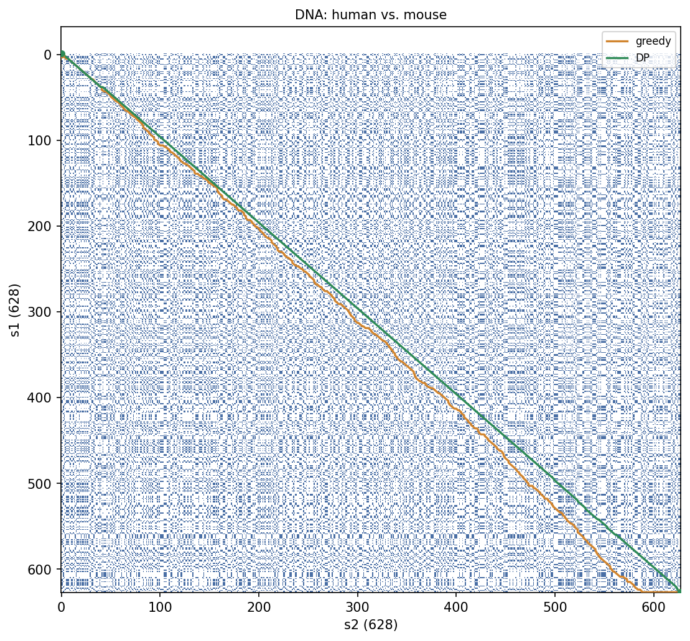
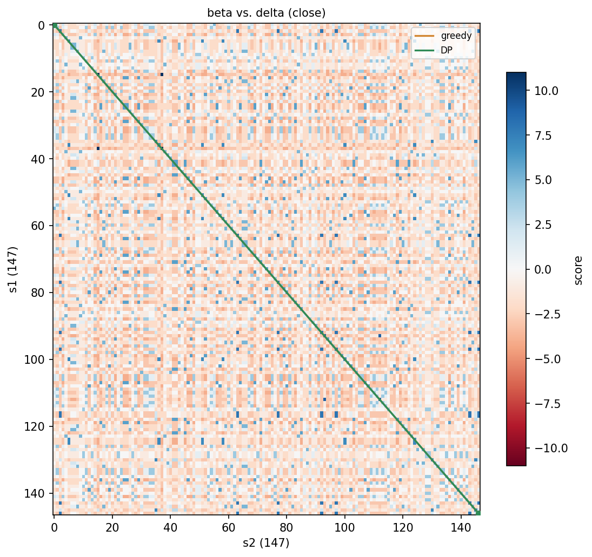
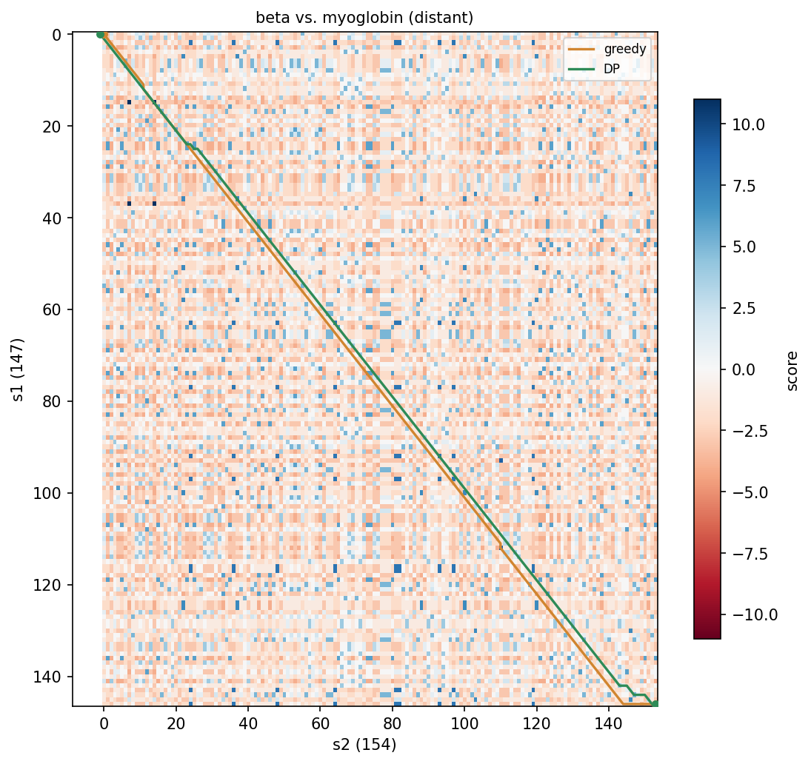
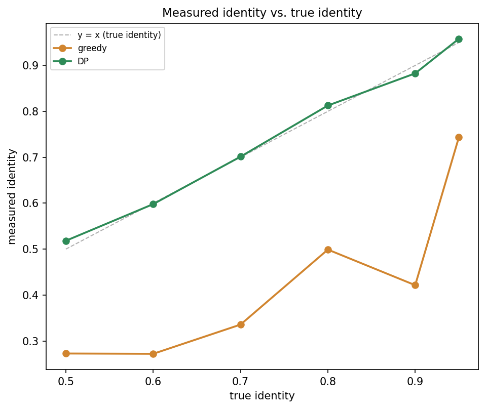

# TP 2: alineamiento de a pares

Para este TP hay que programar dot-plots, filtros y un algoritmo que recorra el dot-plot para obtener un alineamiento tanto de ADN como de proteínas. Los ejercicios están resueltos en `exercises/` y se corren en la consola con `python3 main.py <ejercicio>` (por ejemplo `python3 main.py 3.1g`).

Hablando con los profesores sobre el trabajo entendimos que la solución que propone el TP no es óptima, así que quisimos implementar un algoritmo de programación dinámica (DP) que encuentre, bajo ciertas reglas (penalidad de gap, matriz de sustitución), el mejor alineamiento posible.

Este informe compara los tres resultados: el algoritmo greedy que propone el TP, la DP y BLAST. El código de la DP está en `dyn_align.py`, y `python3 dyn_align.py` corre de punta a punta cada comparación que se cita acá.

---

## Datos

Los mismos pares que usa el circuito de `exercises/`, para que las tres comparaciones (greedy, DP, BLAST) trabajen siempre sobre la misma entrada.

| Par | Secuencias | Fuente | Largo |
|---|---|---|---|
| ADN, especies distintas | HBB humana (`NM_000518.5`) vs. Hbb-b1 de ratón (`NM_008220.3`) | mRNA, NCBI | 628 nt cada una |
| Proteína, cercano | beta-globina humana (`NP_000509.1`) vs. delta-globina humana (`NP_000510.1`) | NCBI | 147 aa cada una |
| Proteína, lejano | beta-globina humana (`NP_000509.1`) vs. mioglobina humana (`NP_005359.1`) | NCBI | 147 y 154 aa |

El par de proteínas "cercano" (beta y delta globina) tiene 93% de identidad; el "lejano" (beta-globina y mioglobina) baja a ~25%. Un caso fácil y uno difícil, para ver si el greedy, la DP y BLAST se ponen de acuerdo en los dos.

---

## Los algoritmos: greedy vs. DP

El Algoritmo greedy recorre el dot-plot con una decisión local: parado en una celda de la matriz, mira el valor de sus tres vecinas (diagonal, vertical, horizontal) y avanza a la que valor mas alto tenga. No guarda un puntaje acumulado de toda la matriz, y no vuelve atrás a reconsiderar una decisión ya tomada.

El DP hace lo contrario, en vez de mirar desde cada celda para adelante, mira para atras, y elige de que celda le conviene "venir" y recién al final reconstruye el camino óptimo con traceback.

El primero toma una decisión local, paso a paso, sin garantías; el otro garantiza el mejor alineamiento posible para esa forma de puntuar.

---

## ADN: HBB humana vs. Hbb-b1 de ratón

| | Greedy | DP (`dyn_align`) | BLAST (blastn) |
|---|---|---|---|
| Largo | 752 | 634 | 630 |
| Identidad | 29,8% (224/752) | 78,5% (498/634) | 79% (500/630) |
| Gaps | 248 | 12 | 14 |
| E-value | — | — | 5e-154 |



*Naranja: camino del algoritmo greedy. Verde: camino de la DP. El greedy se despega de la diagonal cada vez más a medida que avanza, persiguiendo ruido de fondo; la DP se mantiene pegada a ella de punta a punta.*

El algoritmo greedy corre acá sobre el dot-plot sin filtrar. Con ADN, el fondo tiene ruido real: dos bases cualquiera coinciden 1 de cada 4 veces (solo hay cuatro letras posibles). Ese ruido alcanza para que la decisión greedy ("cuál de las tres celdas vecinas me aporta mas valor?") se deje engañar todo el tiempo por una coincidencia de fondo en una celda vecina. El camino sale disparado a abrir gaps persiguiendo señal que no es real, y termina con 248 gaps sobre un alineamiento de 752 posiciones, con una identidad (29,8%) apenas por encima del 25% que da comparar dos secuencias sin ninguna relación.

La DP evalúa todos los caminos posibles antes de comprometerse con uno, así que el ruido de una celda vecina no la desvía: nunca abre un gap salvo que eso realmente mejore el puntaje total. El resultado (78,5%, 12 gaps) queda a menos de un punto de BLAST (79%, 14 gaps). Un recorrido puramente local y sin vuelta atrás no alcanza para separar señal de ruido en una secuencia real; la DP sí, por diseño.

---

## Proteína, par cercano: beta-globina vs. delta-globina

| | Greedy | DP (`dyn_align`) | BLAST (blastp) |
|---|---|---|---|
| Largo | 147 | 147 | 147 |
| Identidad | 93,2% (137/147) | 93,2% (137/147) | 93% (137/147) |
| Gaps | 0 | 0 | 0 |



*Naranja: camino del algoritmo greedy. Verde: camino de la DP. Las dos líneas están tan superpuestas que el naranja no se llega a ver: los dos algoritmos toman exactamente el mismo camino.*

Los tres métodos coinciden exactamente. Tiene sentido: este par tiene 93% de identidad real y el mismo largo (147 aa), así que casi todas las casillas de la diagonal principal son matches. Con una diagonal tan marcada, incluso una decisión puramente local como la del algoritmo greedy la encuentra sin problemas ya que en ningun momento hay una celda vecina lo suficientemente atractiva como para "tentarlo" a abrir un gap. El resultado de la DP también es insensible al costo de gap sobre este par: probamos con gaps de costo -1, -4, -8 y -11 y los cuatro dan exactamente 93,2%/0 gaps.

---

## Proteína, par lejano: beta-globina vs. mioglobina

### Greedy vs. DP

| | Greedy (w=7, umbral=12) | DP, gap=-11 |
|---|---|---|
| Largo | 156 | 155 |
| Identidad | 7,7% (12/156) | 24,5% (38/155) |
| Gaps | 11 | 9 |



*Naranja: camino del algoritmo greedy. Verde: camino de la DP. Arrancan juntos y se van separando: el greedy termina desviándose sobre el final, donde la diagonal es más débil.*

La DP más que triplica la identidad del greedy (24,5% contra 7,7%) con casi el mismo largo y la misma cantidad de gaps. El greedy corre sobre el dot-plot filtrado y binarizado (w=7, umbral=12); la DP corre directo sobre la matriz de comparación cruda, sin filtrar. La DP tiene más información disponible (la matriz completa, con los valores reales de BLOSUM62) y además la usa mejor: evalúa el problema entero y encuentra el camino que de verdad maximiza el puntaje, mientras que el greedy sigue tomando una decisión local, un paso a la vez, y con una diagonal tan débil (25% de identidad real) eso ya no alcanza.

Moviendo el umbral del greedy se puede ver que el resultado no mejora:
(dato de `exercises/ex32/c.py`)

```
umbral    identidad   gaps
     5       13,4%     13
    12        7,7%     11
    20        7,7%      9
```

El mejor caso (umbral bajo, más señal disponible) da 13,4%, todavía muy por debajo del 24,5% de la DP. Filtrar más agresivo no ayuda: con umbral 20 casi no queda dot-plot y el camino sale derecho por pura falta de opciones, empatando con umbral 12 en 7,7%.

El costo de gap de la DP sí importa, y de una forma menos obvia (dato de `dyn_align.run_proteins()`):

```
pair                               gap  length   identity   gaps
beta vs. myoglobin (distant)        -1     193      30,1%     85
beta vs. myoglobin (distant)        -4     159      27,0%     17
beta vs. myoglobin (distant)        -8     156      25,6%     11
beta vs. myoglobin (distant)       -11     155      24,5%      9
```

Con gap barato (-1, casi gratis en la escala de BLOSUM62, donde un match vale hasta +11) la DP abre 85 gaps para esquivar mismatches, y eso infla la identidad a 30,1% sobre un alineamiento larguísimo y fragmentado. A medida que el gap se encarece, la DP deja de esquivar y empieza a pasar por mismatches en la diagonal: menos gaps (85→9), alineamiento más corto (193→155), pero identidad que baja (30,1%→24,5%). Un gap más permisivo no da un alineamiento mejor, da uno que usa gaps para "maquillar" la identidad. Incluso una DP exacta puede reportar un número inflado si el parámetro de gap está mal elegido.

### Contra BLAST: la diferencia real no es el largo, es la significancia

Con parámetros default, blastp sobre este par devuelve "No significant similarity found". El E-value del mejor tramo que encuentra no llega al umbral de significancia que usa por default (0,05). Con ~25% de identidad, lo que encontró es tan parecido a lo que esperaría encontrar comparando dos secuencias sin ninguna relación, que BLAST prefiere no afirmar nada en vez de arriesgar un falso positivo.

Esto es algo que ni el greedy ni nuestra DP pueden hacer. Ninguno de los dos tiene una noción de "esto podría ser casualidad": los dos van a devolver siempre el mejor camino que encuentren, sea o no sea significativo. BLAST, en cambio, tiene incorporado un modelo estadístico (contra qué se compara el puntaje obtenido si las secuencias fueran aleatorias) que le permite decir "no sé" en vez de forzar una respuesta.

Forzamos igual un resultado subiendo el "Expect threshold" a un valor muy permisivo:

| | Greedy | DP (gap=-11) | BLAST forzado (blastp) |
|---|---|---|---|
| Largo / cobertura | 156 (global) | 155 (global) | 125 de 147 (parcial) |
| Identidad | 7,7% | 24,5% | 16% (20/125) |
| Gaps | 11 | 9 | 31 (24%) |
| E-value | — | — | 13 |

Un E-value de 13 significa que se esperarían en promedio 13 aciertos así de buenos por puro azar: es ruido con forma de alineación, no una alineación real. La DP queda por encima incluso de este resultado forzado (24,5% contra 16%, sobre la secuencia completa en vez de un tramo parcial de 125 residuos), mientras que el greedy queda claramente por debajo de los tres. Forzar a BLAST a portarse como los otros dos (devolver siempre un alineamiento) no lo mejora, lo empeora. Su ventaja real está en el paso previo que ni el greedy ni la DP tienen: decidir si vale la pena confiar en el resultado antes de mostrarlo.

---

## Qué le falta a nuestra DP para ser directamente comparable a BLAST

**Gaps afines.** BLAST cobra un costo distinto por abrir un gap y por extenderlo (con BLOSUM62, blastp usa por default algo del orden de -11 para abrir y -1 para extender), mientras que nuestra DP cobra lo mismo por cada paso V/H (gap lineal). El barrido de costo de gap de la sección anterior es un sustituto aproximado de eso.

**Significancia estadística.** La DP no tiene equivalente al E-value: no hay forma de que diga "este puntaje también podría salir de dos secuencias al azar". Eso es precisamente lo que separó a BLAST de los otros dos métodos en el par lejano, y es la limitación más importante de las dos implementaciones de este TP. El greedy tampoco tiene esa noción, y además, a diferencia de la DP, ni siquiera garantiza encontrar el mejor camino posible para la señal que sí tiene disponible.

---

## Sobre el código

Las corridas de esta comparación (ADN, los dos pares de proteína, el barrido de gap) están consolidadas en `dyn_align.main()`, así que `python3 dyn_align.py` reproduce cada número citado acá.

El resto del repositorio (`exercises/`, `dotplot.py`, `paths.py`, `plots.py`, `substitution.py`, `sequences.py`) es la resolución de 3.1 y 3.2 tal como los pide el TP, y se armó con Claude como la base de comparación contra la que medimos la DP.

---

## p.d. (bonus?):

Todo lo anterior compara un par cercano y uno lejano, un ejemplo de cada extremo. Para ver si el patrón se sostiene se nos ocurrio armar un barrido de pares sintéticos de ADN con identidades controladas (`sequences.mutate()`, largo 300), de 95% a 50%, usando 5 randomizaciones por punto (`dyn_align.run_identity_sweep()`).
Este chequeo decidimos hacerlo sin BLAST: intentamos automatizarlo con `NCBIWWW.qblast()` para no tener que pegarle a mano a cada par, pero empezamos a chocar con el límite de requests de NCBI, y como ya estabamos tarde para la entrega preferimos dejarlo así, solo greedy contra DP.
Sería interesante confirmar que BLAST y DP se mantienen mas menos alineados.



```
true identity   greedy    DP
          95%    74,3%   95,8%
          90%    42,1%   88,3%
          80%    49,9%   81,3%
          70%    33,6%   70,1%
          60%    27,2%   59,8%
          50%    27,3%   51,8%
```

La DP sigue la línea y=x de punta a punta: mide la identidad real del par en los seis niveles, con un error de un par de puntos como mucho. El greedy no solo queda por debajo en todo el rango, además baja de forma poco prolija: a 90% de identidad real mide menos (42,1%) que a 80% (49,9%). Eso muestra que no es solo peor en promedio, es inestable, sensible a en qué posiciones exactas cayeron las mutaciones de cada randomizacion. El único punto donde remonta un poco es 95%, donde casi no hay ruido de fondo para que la decisión local se equivoque.
